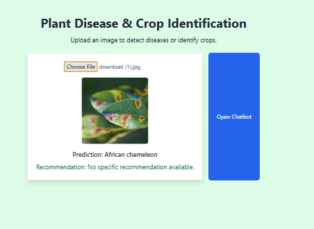

# 🌿 Plant Disease & Crop Identification

🚀 **Hackathon Project** - End-to-end website for plant disease detection, crop identification, and AI-based recommendations.



---

## ✅ Current Progress
### 🔹 Backend:
✔️ **FastAPI-based backend**  
✔️ **Pretrained MobileNetV3 model for image classification**  
✔️ **ImageNet label mapping for proper crop identification**  
✔️ **Recommendation system with `recommendations.json`**  
✔️ **CORS enabled for frontend integration**  
✔️ **Error handling & response formatting**  

### 🔹 Frontend:
✔️ **Minimal UI for image upload & results display**  
✔️ **File upload & preview functionality**  
✔️ **Styled UI with chatbot button (not yet functional)**  

---

## 🚀 Upcoming Features
🔜 **Chatbot Integration** (Llama 3 API for Q&A & guidance)  
🔜 **Plant Disease-Specific Model** (Fine-tuned classifier)  
🔜 **Improved UI/UX** (Mobile responsiveness, better design)  
🔜 **Database for Image Logging** (Store user queries for insights)  
🔜 **Voice-based Interaction** (Optional if time permits)  

---

## 📌 How to Run Locally
```bash
# Clone this repo
git clone <repo_url>
cd plant-disease-crop-id

# Backend setup
cd backend
pip install -r requirements.txt
uvicorn main:app --reload

# Frontend setup (if React/Vue)
cd frontend
npm install
npm start
```

---
